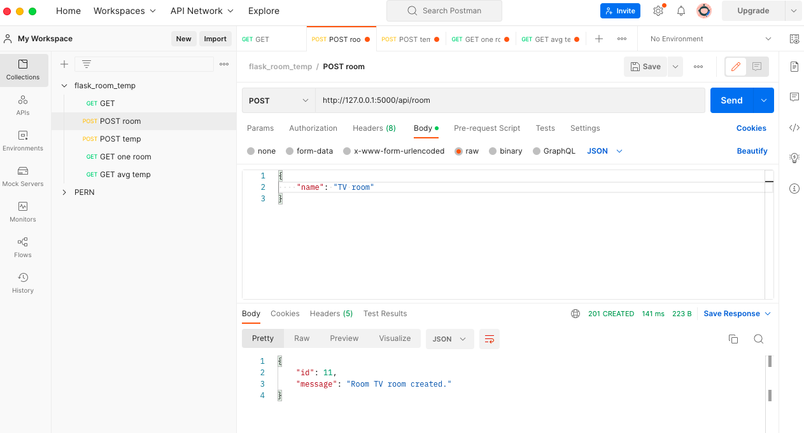
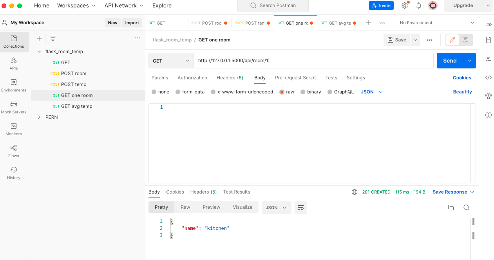
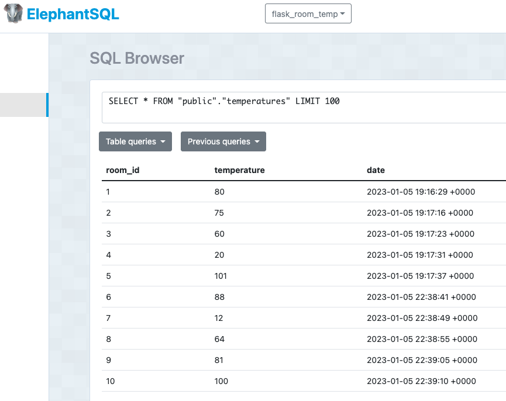

# flask-lessons

## Description

This repo is another introduction to Flask, where we created our first API using Flask, Postman, and ElephantSQL/Postgres. We used POST requests to create "rooms" and insert temperature data for each. We then created GET requests to display the data of one room, as well as the global average of all the rooms. Other necessary dependencies we used were dotenv and psycopg2, which required us to set the python version to 3.10.7 with pyenv.

